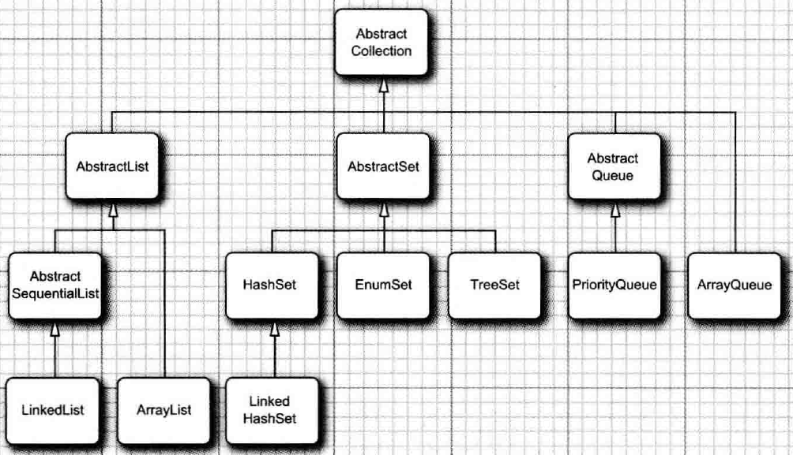
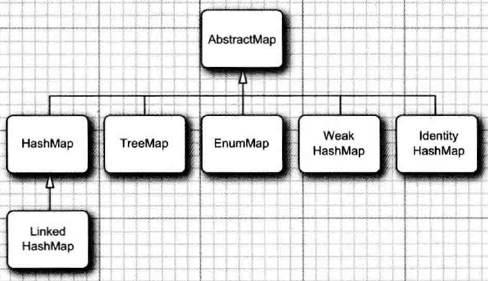

# Java Container

---

## Container Classes Inheritance

## Collection

List

- LinkedList

  - An ordered sequence that can be deleted and inserted efficiently at any position

- ArrayList
  - An index sequence that can be dynamically increased and decreased

Set

- HashSet

  - An unordered sequence without repeating elements

- LinkedHashSet

  - A set that can record the order in which elements are inserted

- TreeSet

  - An ordered sequence

- EnumSet
  - A set containing enumerated types

Queue

- PriorityQueue

  - A set that allows efficient deletion of the smartest element

- ArrayDeque
  - A deque implemented by circular array

## Map

- LinkedHashMap

  - A map that can record the order in which key-value item are inserted

- TreeMap

  - A map with ordered key value

- EnumMap

  - A map with enumerated type of key value

- WeakHashMap

  - A map that can be recycled by gc when useless

- IdentityHashMap
  - A map that compared key value by == instead of equals

## Iterator

- Every Containers Implementing Collection must Implement an inner class constructing an iterator object and a method returning an iterator object

- There is a composition relationship between Collection and iterator

- Original object will be locked when using iterator object producing from it

## Collections Class

- It's a tool class, it contains many methods which can be used for objects implementing 'List' interface

- A class need to use sort methods of Collections must implement Comparable interface
