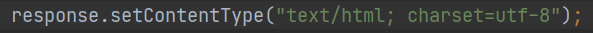

# Character Encode

---

## First

- Set the file reading format in the content-type of the HTTP protocol to **utf-8**

- 

- more information about content-type, click [here](./AboutHttpProtocol.md)