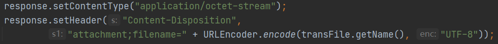

# Download Resources

## first

- Set content-type to "application/octet-stream", then set content-disposition to "attachment;filename=resource-name"
- 
- Know more about content-type and content-disposition, click [here](./AboutHttpProtocol.md)